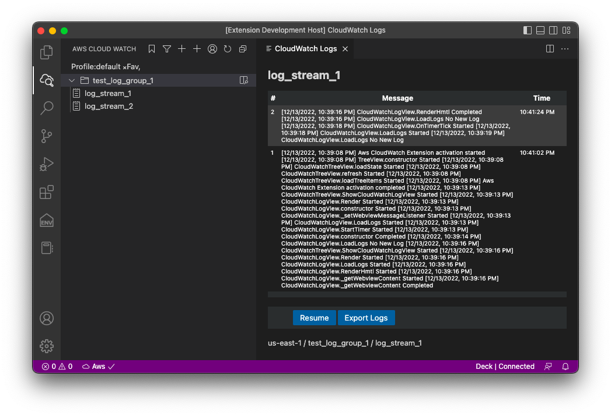

# Aws CloudWatch 
This is a vscode extension to browse Aws CloudWatch Logs.

To Access Aws, you need to configure aws credentials.
For more detail on aws credentials
https://docs.aws.amazon.com/cli/latest/userguide/cli-configure-files.html

The extension uses same credentials and allows you to select the profile (aws aim user).

If you need proxy settings, goto vscode settings and update Http:Proxy setting

## Bug Report
To report your bugs or request new features, use link below\
https://github.com/necatiarslan/aws-cloudwatch/issues/new

## TODO:
- Search in message
- Show loading message when waiting
- Special color codes for logs

Follow me on linkedin to get latest news \
https://www.linkedin.com/in/necati-arslan/

Thanks, \
Necati ARSLAN \
necatia@gmail.com