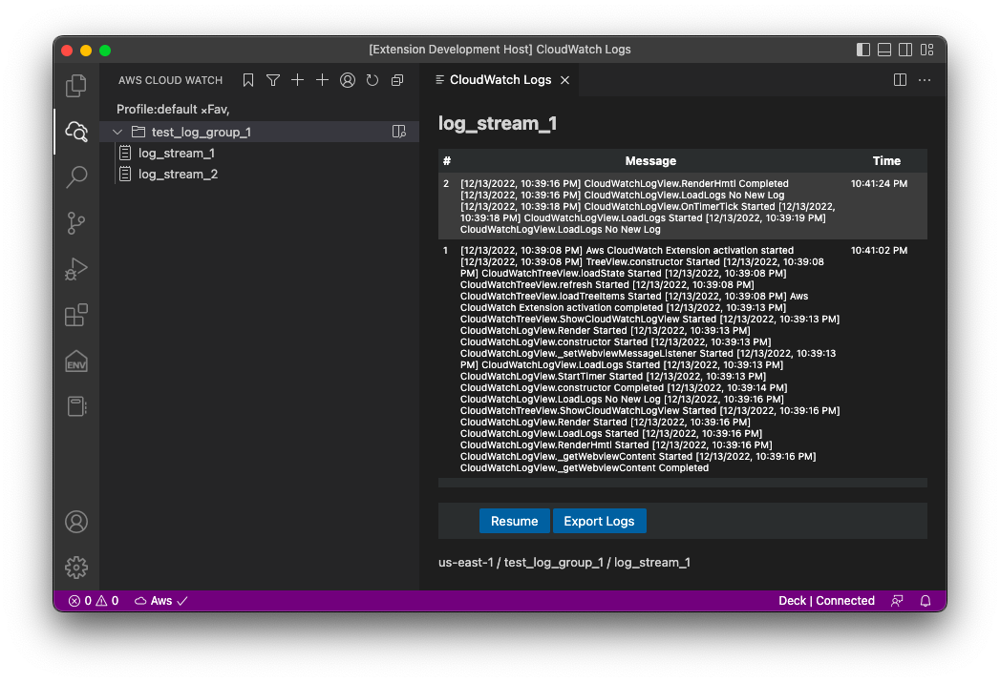

# AWS CloudWatch - VSCode Extension

[](https://marketplace.visualstudio.com/items?itemName=NecatiARSLAN.aws-cloudwatch-vscode-extension)
[](https://marketplace.visualstudio.com/items?itemName=NecatiARSLAN.aws-cloudwatch-vscode-extension)
[](https://github.com/necatiarslan/aws-cloudwatch/blob/main/LICENSE)

> **Access and review your AWS CloudWatch logs directly from VSCode - faster, easier, and more convenient than the AWS console.**



---

## 🚀 Overview

AWS CloudWatch extension brings powerful log viewing capabilities directly into Visual Studio Code, eliminating the need to switch between your IDE and the AWS console. View, search, and filter your CloudWatch logs with a streamlined interface designed for developers.

### ✨ Key Features

- 🌍 **Multi-Region Support** - Add log groups and streams from different AWS regions
- ⚡ **Lightning Fast** - Loads logs faster than the AWS console
- 🔍 **Advanced Filtering** - Search, filter, hide, and date/time range filtering
- ⭐ **Favorites** - Mark frequently accessed logs for quick access
- 📦 **Centralized View** - Manage all your logs in one place
- 🎯 **Real-time Updates** - Auto-refresh with configurable intervals
- 💾 **Export Logs** - Save logs to local files for offline analysis
- 🎨 **Syntax Highlighting** - Color-coded error and exception messages
- 📝 **Text Wrapping** - Toggle text wrapping for better readability
- ⏱️ **Time-based Filtering** - Filter logs by date and hour

---

## 📋 Table of Contents

- [Installation](#-installation)
- [AWS Credentials Setup](#-aws-credentials-setup)
- [Getting Started](#-getting-started)
- [Features](#-features)
- [Usage](#-usage)
- [Configuration](#-configuration)
- [Troubleshooting](#-troubleshooting)
- [Roadmap](#-roadmap)
- [Contributing](#-contributing)
- [Support](#-support)
- [License](#-license)

---

## 💿 Installation

### From VSCode Marketplace

1. Open VSCode
2. Press `Ctrl+P` (Windows/Linux) or `Cmd+P` (Mac)
3. Type: `ext install NecatiARSLAN.aws-cloudwatch-vscode-extension`
4. Press Enter

### From GitHub

```bash
# Clone the repository
git clone https://github.com/necatiarslan/aws-cloudwatch.git

# Install dependencies
cd aws-cloudwatch
npm install

# Compile the extension
npm run compile

# Package the extension
vsce package
```

---

## 🔑 AWS Credentials Setup

### Prerequisites

This extension requires AWS credentials to be configured on your system. You have several options:

### Option 1: AWS CLI Configuration (Recommended)

```bash
# Install AWS CLI
# https://docs.aws.amazon.com/cli/latest/userguide/getting-started-install.html

# Configure credentials
aws configure
```

You'll be prompted for:
- **AWS Access Key ID**: Your access key
- **AWS Secret Access Key**: Your secret key
- **Default region name**: e.g., `us-east-1`
- **Default output format**: `json`

### Option 2: Manual Configuration

Create or edit `~/.aws/credentials`:

```ini
[default]
aws_access_key_id = YOUR_ACCESS_KEY_ID
aws_secret_access_key = YOUR_SECRET_ACCESS_KEY

[profile-name]
aws_access_key_id = ANOTHER_ACCESS_KEY_ID
aws_secret_access_key = ANOTHER_SECRET_ACCESS_KEY
```

Create or edit `~/.aws/config`:

```ini
[default]
region = us-east-1

[profile profile-name]
region = eu-west-1
```

### Option 3: Environment Variables

```bash
export AWS_ACCESS_KEY_ID="your-access-key-id"
export AWS_SECRET_ACCESS_KEY="your-secret-access-key"
export AWS_DEFAULT_REGION="us-east-1"
```

### 📚 Additional Resources

- [AWS CLI User Guide](https://docs.aws.amazon.com/cli/latest/userguide/cli-configure-files.html)
- [Video Tutorial: AWS Credentials Setup](https://www.youtube.com/watch?v=SON8sY1iOBU)
- [IAM Best Practices](https://docs.aws.amazon.com/IAM/latest/UserGuide/best-practices.html)

### Required IAM Permissions

Your AWS user/role needs the following permissions:

```json
{
  "Version": "2012-10-17",
  "Statement": [
    {
      "Effect": "Allow",
      "Action": [
        "logs:DescribeLogGroups",
        "logs:DescribeLogStreams",
        "logs:GetLogEvents"
      ],
      "Resource": "*"
    }
  ]
}
```

---

## 🎯 Getting Started

### Quick Start Guide

1. **Open the Extension**
   - Click the AWS CloudWatch icon in the Activity Bar (left sidebar)

2. **Select AWS Profile** (if you have multiple profiles)
   - Click the account icon in the toolbar
   - Select your AWS profile from the dropdown

3. **Add a Log Group**
   - Click the folder icon (📁) in the toolbar
   - Enter the AWS region (e.g., `us-east-1`)
   - Select log group(s) from the list

4. **Add Log Streams**
   - Right-click on a log group
   - Select "Add Log Stream By Name" or "Add All Log Streams"
   - For time-based: "Add Log Streams By Date"

5. **View Logs**
   - Click on any log stream
   - Click the preview icon (👁️) to open the log viewer

---

## 🎨 Features

### 1. Multi-Region Support

Manage log groups from multiple AWS regions in a single interface.

```
📁 us-east-1
  └── 📄 /aws/lambda/my-function
      └── 📜 2024/01/15/[$LATEST]abc123
📁 eu-west-1
  └── 📄 /aws/ecs/my-service
      └── 📜 2024/01/15/task-123
```

### 2. Advanced Filtering

**Search** - Find specific text in logs
```
Search: "error" → highlights all instances
```

**Filter** - Show only matching logs
```
Filter: "status=200" → displays only matching entries
```

**Hide** - Exclude unwanted logs
```
Hide: "health-check" → hides all health check logs
```

**Date/Time Filter** - Filter by date and hour
```
☑️ Date/Time Filter | From: [2024-01-15] Hour: [14 ▼]
Shows logs from 2024-01-15 14:00 onwards
```

### 3. Text Wrapping

Toggle between wrapped and unwrapped text for better readability:
- ☑️ **Wrapped** - Long messages break across multiple lines
- ☐ **Unwrapped** - Messages display on single line with horizontal scroll

### 4. Real-time Updates

- Auto-refresh with configured intervals
- Pause/Resume button to control updates
- Visual indicator when loading new logs

### 5. Export Logs

Save logs to local files:
- Click "Export Logs" button
- Logs saved to temporary file
- Automatically opened in new VSCode tab

### 6. Favorites

Mark frequently accessed log groups/streams:
- Right-click → "Fav" to add to favorites
- Filter by favorites using the bookmark icon (🔖)
- Quick access to important logs

### 7. Syntax Highlighting

Automatically highlights:
- 🔴 Errors and exceptions in red
- 🟡 Search matches in yellow
- Clean, readable log display

---

## 📖 Usage

### Toolbar Actions

| Icon | Action | Description |
|------|--------|-------------|
| 🔖 | Show Only Favorite | Filter to show only favorited items |
| 🔍 | Filter | Apply global filter to log groups |
| 📁 | Add Log Group (From List) | Browse and add log groups |
| 📂 | Add Log Group (By Name) | Search and add specific log groups |
| 👤 | Select AWS Profile | Switch between AWS profiles |
| 🔄 | Refresh | Reload the tree view |

### Context Menu Actions

**Log Group:**
- Add to Favorites / Remove from Favorites
- Remove Log Group
- Add Log Stream By Name
- Add All Log Streams
- Add Log Streams By Date
- Remove All Log Streams

**Log Stream:**
- Add to Favorites / Remove from Favorites
- Show Logs (opens viewer)
- Remove Log Stream

### Log Viewer Controls

**First Row:**
- [Pause/Resume] - Control auto-refresh
- [Refresh] - Manually reload logs
- [Export Logs] - Save to file
- [Search] - Find text in logs
- [Filter] - Show only matching logs
- [Hide] - Exclude matching logs
- [☑️ Wrap] - Toggle text wrapping

**Second Row:**
- [☐ Date/Time Filter] - Enable time-based filtering
- [Date Input] - Select start date
- [Hour Dropdown] - Select start hour (0-23)

### Keyboard Shortcuts

- `Enter` in Search/Filter/Hide fields - Apply filter without refresh

---

## ⚙️ Configuration

### Proxy Settings

If you're behind a corporate proxy:

1. Open VSCode Settings (`Ctrl+,` or `Cmd+,`)
2. Search for "proxy"
3. Set `http.proxy` to your proxy URL:
   ```
   http://proxy.company.com:8080
   ```

### Custom AWS Endpoint

For LocalStack or custom AWS endpoints:

1. Right-click in the tree view
2. Select "Update Aws EndPoint"
3. Enter your custom endpoint URL
4. Leave empty to return to AWS default

---

## 🔧 Troubleshooting

### Common Issues

#### "Credentials Not Found" Error

**Solution:**
1. Verify AWS credentials are configured:
   ```bash
   cat ~/.aws/credentials
   ```
2. Check environment variables:
   ```bash
   echo $AWS_ACCESS_KEY_ID
   ```
3. Run `aws configure` to reconfigure

#### "Access Denied" Error

**Solution:**
- Verify your IAM user/role has CloudWatch Logs permissions
- Check the [Required IAM Permissions](#required-iam-permissions) section

#### "Network Error" / Connection Timeout

**Solution:**
1. Check your internet connection
2. Configure proxy settings if behind corporate firewall
3. Verify AWS service endpoints are accessible

#### Extension Not Loading

**Solution:**
1. Check OUTPUT panel → "AWS CloudWatch-Log"
2. Reload VSCode window (`Ctrl+R` or `Cmd+R`)
3. Reinstall the extension

#### Logs Not Appearing

**Solution:**
1. Click Refresh button
2. Verify log stream has recent logs
3. Check date/time filter settings
4. Review filter/hide/search settings

---

## 🗺️ Roadmap

### Planned Features

- [ ] Log Stream Filter Groups
- [ ] Log Stream Name Filter
- [ ] Enhanced log viewing for long messages
- [ ] JSON log formatting and navigation
- [ ] Custom log parsing rules
- [ ] Log analytics and statistics
- [ ] CloudWatch Insights integration
- [ ] Multi-log stream comparison
- [ ] Markdown export support

### Feature Requests

Have an idea? [Open an issue](https://github.com/necatiarslan/aws-cloudwatch/issues/new) with the `enhancement` label.

---

## 🤝 Contributing

Contributions are welcome! Here's how you can help:

### Reporting Bugs

1. Check [existing issues](https://github.com/necatiarslan/aws-cloudwatch/issues)
2. Create a [new issue](https://github.com/necatiarslan/aws-cloudwatch/issues/new)
3. Include:
   - Extension version
   - VSCode version
   - Steps to reproduce
   - Expected vs actual behavior
   - Screenshots if applicable

### Contributing Code

1. Fork the repository
2. Create a feature branch: `git checkout -b feature/amazing-feature`
3. Make your changes
4. Test thoroughly
5. Commit: `git commit -m 'Add amazing feature'`
6. Push: `git push origin feature/amazing-feature`
7. Open a Pull Request

### Development Setup

```bash
# Clone your fork
git clone https://github.com/YOUR-USERNAME/aws-cloudwatch.git

# Install dependencies
npm install

# Run in development mode
# Press F5 in VSCode to launch Extension Development Host

# Compile
npm run compile

# Run tests
npm test

# Lint code
npm run lint
```

---

## 💬 Support

### Get Help

- 📖 [Documentation](https://github.com/necatiarslan/aws-cloudwatch)
- 🐛 [Report Bug](https://github.com/necatiarslan/aws-cloudwatch/issues/new)
- 💡 [Request Feature](https://github.com/necatiarslan/aws-cloudwatch/issues/new)
- 💬 [Discussions](https://github.com/necatiarslan/aws-cloudwatch/discussions)

### Stay Connected

- [](https://www.linkedin.com/in/necati-arslan/)
- [](https://github.com/necatiarslan)

### Show Your Support

If you find this extension helpful:

- ⭐ [Star the repository](https://github.com/necatiarslan/aws-cloudwatch)
- ✍️ [Leave a review](https://marketplace.visualstudio.com/items?itemName=NecatiARSLAN.aws-cloudwatch-vscode-extension)
- ☕ [Sponsor on GitHub](https://github.com/sponsors/necatiarslan)

---

## 📄 License

This project is licensed under the **Apache License 2.0** - see the [LICENSE](LICENSE) file for details.

```
Copyright 2024 Necati ARSLAN

Licensed under the Apache License, Version 2.0 (the "License");
you may not use this file except in compliance with the License.
You may obtain a copy of the License at

    http://www.apache.org/licenses/LICENSE-2.0

Unless required by applicable law or agreed to in writing, software
distributed under the License is distributed on an "AS IS" BASIS,
WITHOUT WARRANTIES OR CONDITIONS OF ANY KIND, either express or implied.
See the License for the specific language governing permissions and
limitations under the License.
```

---

## 🙏 Acknowledgments

Special thanks to all [contributors](https://github.com/necatiarslan/aws-cloudwatch/graphs/contributors) who have helped improve this extension.

Built with ❤️ by [Necati ARSLAN](https://www.linkedin.com/in/necati-arslan/)

---

## 📧 Contact

**Necati ARSLAN**

- 📧 Email: necatia@gmail.com
- 💼 LinkedIn: [necati-arslan](https://www.linkedin.com/in/necati-arslan/)
- 🐙 GitHub: [@necatiarslan](https://github.com/necatiarslan)

---

<div align="center">

**[⬆ Back to Top](#aws-cloudwatch---vscode-extension)**

Made with ❤️ for AWS developers

</div>