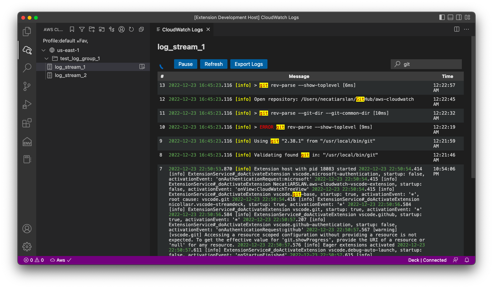

# Aws CloudWatch 

This extension is designed to make it easier and more convenient for developers to access and review their Aws CloudWatch logs without leaving vscode. \
It allows you to add multiple log groups and log streams from different regions, giving you a centralized view of all your log data in one place. \
You can use the search function to quickly find specific logs, or add them to your favorites list for easy access later on.

One of the main advantages of this extension is its speed. It loads logs faster than the AWS console, saving you time and frustration. \
It also provides a more streamlined and intuitive interface for browsing and reviewing logs, making it easier to find the information you need.

If you encounter a network error while using it, you may need to add proxy. Simply go to the Visual Studio Code settings and search for "proxy," then enter your HTTP/HTTPS proxy URL to resolve the issue.

Overall, this extension is a valuable tool for any developer working with AWS CloudWatch logs, offering a faster and more convenient way to access and review log data.

## Aws Credentials Setup
To Access Aws, you need to configure aws credentials.
For more detail on aws credentials \
https://docs.aws.amazon.com/cli/latest/userguide/cli-configure-files.html \
https://www.youtube.com/watch?v=SON8sY1iOBU

## Bug Report
To report your bugs or request new features, use link below\
https://github.com/necatiarslan/aws-cloudwatch/issues/new

## Todo
- Log Group View
- Log Stream Filter Groups

Follow me on linkedin to get latest news \
https://www.linkedin.com/in/necati-arslan/

Thanks, \
Necati ARSLAN \
necatia@gmail.com